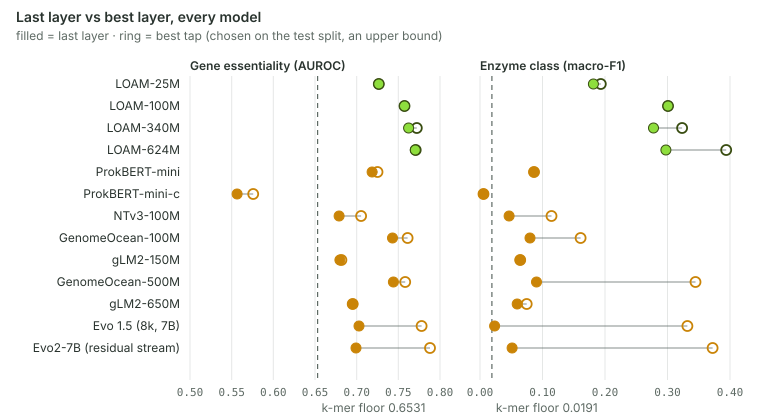
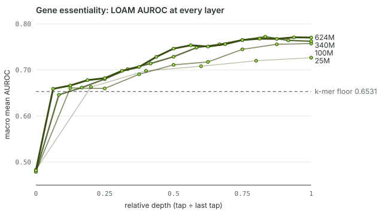
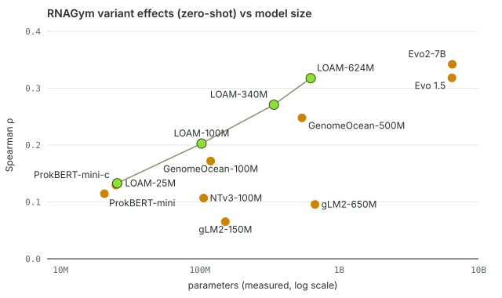

<h3>gLMBench</h3>

<p>
  <sub>A SOILYTIX BENCHMARK · GENOMIC LANGUAGE MODELS ON BACTERIAL GENOMES</sub>
  <br>
  <strong>A benchmark harness for genomic language models, and the code to reproduce the benchmark
  results of the LOAM paper.</strong>
  <br>
  <br>
  <a href="https://github.com/Soilytix/gLMBench/actions/workflows/ci.yml">
    
  </a>
  <a href="LICENSE">
    
  </a>
  <a href="docs/INSTALL.md">
    
  </a>
  <a href="https://huggingface.co/Soilytix">
    
  </a>
</p>

- [What it measures](#what-it-measures)
- [Quickstart](#quickstart)
- [The paper's results](#the-papers-results)
- [How closely you will reproduce them](#how-closely-you-will-reproduce-them)
- [How it works](#how-it-works)
- [Requirements](#requirements)
- [Documentation](#documentation)
- [Licence and citation](#licence-and-citation)

> **Status.** The numbers in [`paper/`](paper/README.md) are frozen: they are the records the
> LOAM manuscript reports, and nothing a benchmark run writes changes them. The manuscript itself
> is not yet public; its citation will be added to [CITATION.cff](CITATION.cff) when the preprint
> is available.

## What it measures

In its current form, gLMBench scores DNA language models on three bacterial genomics tasks taken from published
benchmarks (full [references](#references) below):

- **Gene essentiality** ([BacBench](https://github.com/macwiatrak/BacBench)): can a linear
  probe on the model's embeddings tell essential genes from non-essential ones, in genomes of
  genera it has not seen?
- **Enzyme class** ([DGEB](https://github.com/TattaBio/DGEB)): can a linear probe predict a
  gene's Enzyme Commission class from its DNA?
- **Variant effects** ([RNAGym](https://github.com/MarksLab-DasLab/RNAGym)): without any
  training, does the model's likelihood rank single-nucleotide variants by their measured
  fitness?

The paper evaluated 13 models: the four released LOAM models
([`Soilytix/LOAM-25M`, `-100M`, `-340M`, `-624M`](https://huggingface.co/Soilytix)) and nine
published models (Evo 2, Evo 1.5, gLM2, GenomeOcean, ProkBERT, Nucleotide Transformer v3). All 13
are included here, with their exact settings.

**What you can do with this repository**

| I want to… | Start here |
|---|---|
| check the paper's numbers on my own GPU | [Quickstart](#quickstart), then [docs/REPRODUCING_THE_PAPER.md](docs/REPRODUCING_THE_PAPER.md) |
| look up the paper's results, per layer and per assay | [`paper/`](paper/README.md) |
| benchmark my own model on these tasks | [docs/ADD_A_MODEL.md](docs/ADD_A_MODEL.md) |
| add a task | [docs/ADD_A_TASK.md](docs/ADD_A_TASK.md) |
| use LOAM in my own code | [docs/USING_LOAM.md](docs/USING_LOAM.md) |

---

## Quickstart

**1. Install** (Linux, Python 3.11, conda; details and the separate Evo 2 environment in
[docs/INSTALL.md](docs/INSTALL.md)):

```bash
git clone https://github.com/Soilytix/gLMBench && cd gLMBench
conda env create -f envs/glmbench.yml && conda activate glmbench
pip install -e ".[hf,data,dev,notebook]" -c envs/constraints-paper.txt \
    --extra-index-url https://download.pytorch.org/whl/cu126
```

`envs/constraints-paper.txt` pins the exact package versions the paper's numbers were produced
with.

**2. Check the install** (CPU only; no weights and no downloads needed):

```bash
pytest tests/unit -q
glmbench run --model specs/echo-full.yaml --benchmark dummy_bench --results results/
```

**3. Reproduce one model's results and compare them with the paper.** The LOAM repositories on
the Hugging Face Hub are gated: accept the terms on the model page, then run `hf auth login`.

```bash
scripts/reproduce_paper.sh --model LOAM-25M
```

This downloads the task data (about 230 MB, once) and the model, runs the five task rows, and
prints a metric-by-metric comparison with the paper. LOAM-25M, the smallest model, is the
quickest to run. The result is written to `results/loam_paper/glmb_<model hash>.json`.
`scripts/reproduce_paper.sh --list` shows the 13 model ids; `--all` runs them all.

The notebook [`notebooks/loam_hf_benchmark.ipynb`](notebooks/loam_hf_benchmark.ipynb) does the
same for any LOAM size in a few cells, and plots the per-layer curves.

---

## The paper's results

| Model | Parameters | Essentiality AUROC, last / best layer | EC macro-F1, last / best layer | RNAGym Spearman | RNAGym scoring |
|---|---:|---:|---:|---:|---|
| LOAM-25M | 25.5M | 0.7266 / 0.7266 | 0.1815 / 0.1932 | 0.1329 | log-likelihood |
| LOAM-100M | 102.9M | 0.7574 / 0.7574 | 0.3008 / 0.3008 | 0.2027 | log-likelihood |
| LOAM-340M | 340.0M | 0.7623 / 0.7722 | 0.2776 / 0.3234 | 0.2710 | log-likelihood |
| LOAM-624M | 624.2M | 0.7703 / 0.7708 | 0.2974 / 0.3939 | 0.3176 | log-likelihood |
| ProkBERT-mini | 20.6M | 0.7186 / 0.7250 | 0.0865 / 0.0865 | 0.1145 | masked-marginal LLR |
| ProkBERT-mini-c | 25.0M | 0.5565 / 0.5758 | 0.0056 / 0.0056 | 0.1296 | masked-marginal LLR |
| NTv3-100M | 106.5M | 0.6789 / 0.7053 | 0.0465 / 0.1143 | 0.1067 | masked-marginal LLR |
| GenomeOcean-100M | 119.6M | 0.7430 / 0.7611 | 0.0799 / 0.1610 | 0.1718 | log-likelihood |
| gLM2-150M | 152.5M | 0.6799 / 0.6816 | 0.0643 / 0.0643 | 0.0652 | masked-marginal LLR |
| GenomeOcean-500M | 541.1M | 0.7441 / 0.7583 | 0.0904 / 0.3448 | 0.2479 | log-likelihood |
| gLM2-650M | 670.6M | 0.6953 / 0.6953 | 0.0595 / 0.0747 | 0.0956 | masked-marginal LLR |
| Evo 1.5 (8k, 7B) | 6.45B | 0.7028 / 0.7779 | 0.0234 / 0.3318 | 0.3182 | log-likelihood |
| Evo2-7B (residual stream) | 6.48B | 0.6992 / 0.7880 | 0.0513 / 0.3721 | 0.3421 | log-likelihood |

How to read the table:

- **Last / best layer.** The two probe tasks are scored on the model's last layer, and again
  with one probe per layer ("best layer"). The best layer is chosen on the test split, so it is
  an upper bound; the paper reports both.
- **The k-mer floor.** A probe on plain k-mer counts, with no model at all, reaches 0.6531
  AUROC on essentiality and 0.0191 macro-F1 on EC. Only the part of a score above that floor is
  evidence about the model. RNAGym has no floor: a count vector is not a likelihood model.
- **Compare within a column.** The three tasks use different metrics on different scales;
  never average them.

Every number behind this table (each layer of both sweeps, each of the 11 RNAGym assays) is in
[`paper/reference_scores.csv`](paper/reference_scores.csv), next to the records it comes from.
[docs/CAVEATS.md](docs/CAVEATS.md) explains these points in more detail.

### Figures

The three figures below are drawn from the frozen records in [`paper/`](paper/README.md) by
[`scripts/readme_figures.py`](scripts/readme_figures.py). They are not copies of the
manuscript's figures. LOAM models are green; the published comparators are gold.



*Last-layer and best-layer probe scores for all 13 models, on essentiality (AUROC) and enzyme
class (macro-F1), against the k-mer floor. The best layer is chosen on the test split, so the
ring is an upper bound. Source: `paper/reference_scores.csv` (single-layer and layer-sweep
rows) and `paper/kmer_floor.json`.*



*Gene-essentiality AUROC at every layer of the four LOAM models, plotted against relative depth
(layer index divided by the last layer's index), with the k-mer floor. Source: the
`bacbench-essentiality-layer-sweep` rows of `paper/reference_scores.csv` and
`paper/kmer_floor.json`.*



*Zero-shot RNAGym Spearman (mean over the 11 assays) against measured parameter count, log
scale. Causal models are scored by log-likelihood, masked models by masked-marginal LLR (see
the table above), so the two groups are not scored identically. Source: the `rnagym-dms` rows
of `paper/reference_scores.csv` and the parameter counts in `paper/models.csv`.*

## How closely you will reproduce them

- **LOAM:** the weights released on the Hub, run through this repository, reproduce the paper's
  records **exactly**, on every metric of all five rows, in the pinned reference environment
  (`envs/constraints-paper.txt`). The runs that show it are in
  [`paper/public_route/`](paper/public_route).
- **The nine other models:** each model file (spec) reproduces the paper's model hash, a
  fingerprint of the weights revision and serving settings, so a run scores exactly what the
  paper scored.
- **On other GPUs or library versions**, the last digits can move. `scripts/compare_to_paper.py`
  then applies per-task tolerances; `--exact` requires bitwise agreement.

Details, compute budgets and the full tolerance table:
[docs/REPRODUCING_THE_PAPER.md](docs/REPRODUCING_THE_PAPER.md).

---

## How it works

- A **spec** (`specs/**/*.yaml`) names a model: its weights, their pinned revision, and how to
  serve them.
- An **adapter** (`src/glmbench/adapters/`) turns a spec into a small, fixed interface: embed
  sequences, score sequences, return log-probabilities. The model itself runs in a subprocess,
  in whatever environment it needs, so the benchmark core never imports PyTorch.
- A **task** (`src/glmbench/tasks/`) uses only that interface, and scores the output the way
  the original benchmark does: with its own metric code where that can run without PyTorch
  (RNAGym, DGEB), and with a documented re-implementation where it cannot (BacBench; see
  [NOTICE](NOTICE)).
- Each run writes one JSON **record** per model, named by a **model hash** computed from the
  weights, the settings that change the numbers, and the adapter version. Two runs with the
  same hash are the same experiment; a re-run resumes where it stopped.

The per-model details (which tensor counts as "layer *i*" for each architecture, context
limits, tokenizers) are in [docs/HOW_MODELS_ARE_SERVED.md](docs/HOW_MODELS_ARE_SERVED.md).

## Requirements

- **GPU:** one CUDA GPU per run. We recommend 48 GB of GPU memory for the two 7B models with
  the specs' batch settings; the LOAM models and the other published models need much less, and
  smaller cards work with a lower `token_budget` in the spec. Embedding the essentiality corpus
  (164,630 windows) dominates the run time, which grows with model size.
- **Host RAM:** the essentiality layer sweep keeps every layer's embeddings in memory. Plan for
  about three times *windows × taps × hidden size × 8 bytes* (164,630 windows): roughly 35 GB for LOAM-100M, 80 GB for LOAM-340M, 120 GB for LOAM-624M and over 500 GB for a 7B model with 33 taps.
- **Disk:** about 230 MB of task data, plus the model weights.
- **Hub access:** the LOAM and NTv3 repositories are gated (accept their terms, then
  `hf auth login`). Evo 2 needs its own environment ([docs/INSTALL.md](docs/INSTALL.md)).

## Repository layout

```
gLMBench/
├── src/glmbench/   the package: adapters and runners (one per model family), tasks, leaderboard
├── specs/          one YAML per model: loam/ (4 LOAM models), external/ (9 published models), echo test doubles
├── scripts/        fetch the task data, reproduce the paper, compare with it, compute the k-mer floor
├── paper/          the paper's results: records, a flat table of every metric, the k-mer floor
├── assets/         the README figures, drawn from paper/ by scripts/readme_figures.py
├── notebooks/      a LOAM model from the Hub, through the five task rows, compared with the paper
├── docs/           the guides listed below
├── envs/           conda environments and the exact version pins used for the paper
└── tests/          CPU unit tests (tiny fixtures, no downloads)
```

## Documentation

| Guide | What it covers |
|---|---|
| [INSTALL.md](docs/INSTALL.md) | environments, flash-attn, Hub access, task data, hardware |
| [REPRODUCING_THE_PAPER.md](docs/REPRODUCING_THE_PAPER.md) | every model, compute and memory, expected agreement, tolerances |
| [CAVEATS.md](docs/CAVEATS.md) | how to read the numbers: k-mer floor, best-layer selection, readouts, scoring methods, context limits |
| [TASKS_OVERVIEW.md](docs/TASKS_OVERVIEW.md) | the three tasks, with one page each: [essentiality](docs/task_bacbench_essentiality.md), [EC](docs/task_dgeb_ec_classification.md), [RNAGym](docs/task_rnagym_dms.md) |
| [HOW_MODELS_ARE_SERVED.md](docs/HOW_MODELS_ARE_SERVED.md) | each model's environment, pinned revisions, readout and pitfalls |
| [USING_LOAM.md](docs/USING_LOAM.md) | using the LOAM models outside the benchmark |
| [ADD_A_MODEL.md](docs/ADD_A_MODEL.md) · [ADD_A_TASK.md](docs/ADD_A_TASK.md) | extending the benchmark; `echo` and `loam-hf` are the templates |
| [paper/README.md](paper/README.md) | what the reference records are and how they were prepared |

## Licence and citation

The code is released under the Apache License 2.0 ([LICENSE](LICENSE)). Vendored upstream code
keeps its own licence ([NOTICE](NOTICE)).

The tasks are the work of their authors; gLMBench only serves them. If you use a task, please
cite its source, listed under [References](#references) below. The task data is downloaded from
its upstream sources at pinned revisions and is not redistributed here. Model weights are not
part of this repository and are subject to their own licences.

## References

The three benchmarks gLMBench serves:

1. **BacBench.** Wiatrak, M. *et al.* BacBench: multi-scale and multi-task benchmark for
   evaluating ML models for bacterial genomics across the bacterial tree of life. Code:
   [macwiatrak/BacBench](https://github.com/macwiatrak/BacBench). No paper has been published
   yet; please cite the repository.
2. **DGEB.** West-Roberts, J., Kravitz, J., Jha, N., Cornman, A. & Hwang, Y. Diverse Genomic
   Embedding Benchmark for functional evaluation across the tree of life. *bioRxiv* (2024).
   [doi:10.1101/2024.07.10.602933](https://doi.org/10.1101/2024.07.10.602933). Code:
   [TattaBio/DGEB](https://github.com/TattaBio/DGEB).
3. **RNAGym.** Arora, R., Angelo, M., Choe, C. A., Shearer, C., Kollasch, A., Qu, F., Weitzman,
   R., Gazizov, A., Gurev, S., Xie, E., Marks, D. S. & Notin, P. RNAGym: Large-scale Benchmarks
   for RNA Fitness and Structure Prediction. *bioRxiv* (2025).
   [doi:10.1101/2025.06.16.660049](https://doi.org/10.1101/2025.06.16.660049). Code:
   [MarksLab-DasLab/RNAGym](https://github.com/MarksLab-DasLab/RNAGym).
